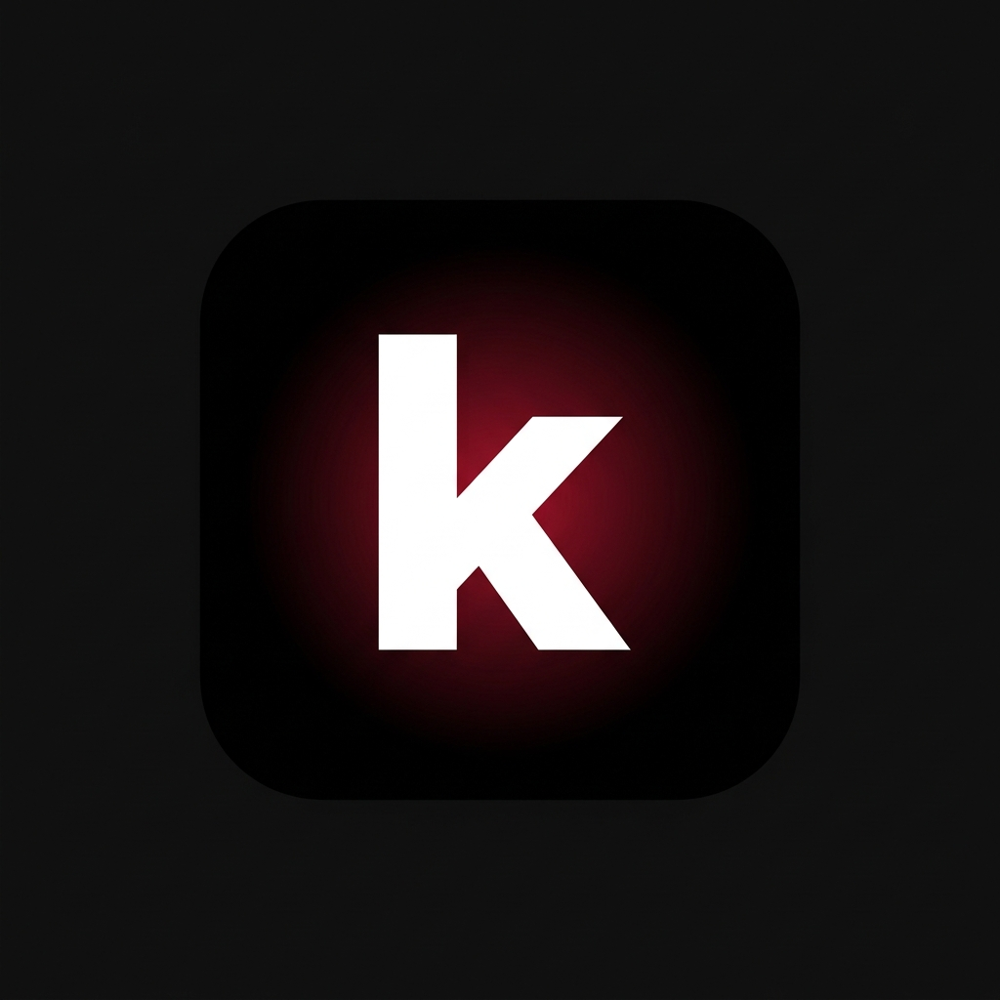
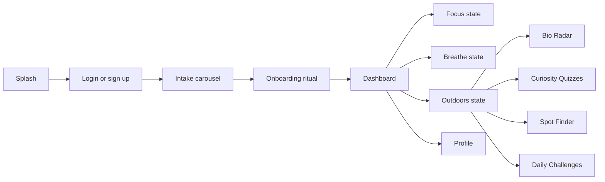
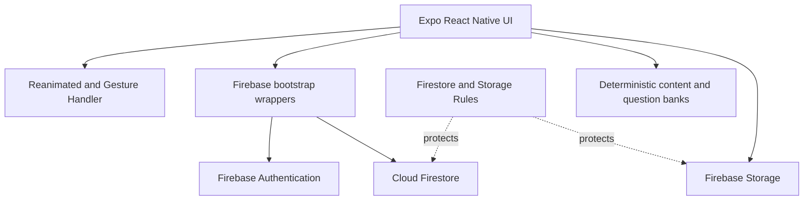

# kenetic



kenetic is a mobile wellbeing and environmental-awareness app built around
small physical actions. It helps users move between focused work, breathing
and restoration practices, and attentive outdoor exploration without turning
those activities into a passive content feed.

The app is a React Native / Expo application for iOS, Android, and web
development. Firebase provides authentication and remote persistence. The
interactive experiences use deterministic local content, so the core product
works without an AI API or a paid AI backend.

## Demo

Demo video: **[Google Drive demo link](https://drive.google.com/file/d/1YRzw8xiRb9WkZUY4YqnlT9OEe4CRp3Xo/view?usp=sharing)**

## Product Overview

The main flow is:



### Focus

Focus is designed for starting a task and reducing friction around the first
small action. The app also includes deterministic Alien Mode reframing, which
stores the original task and selected micro-action in the user's session data.

### Breathe

Breathe provides guided exercises such as calm down, recenter, clear mind,
and deep relax. Exercise launches and session completion data are persisted so
the dashboard can display restoration activity.

### Outdoors

The Outdoors state connects the user's real-world discoveries to lightweight
learning:

- **Bio Radar:** uses the camera or microphone permission flow and deterministic
  local species matching to produce a discovery dossier.
- **Curiosity Quizzes:** builds a remote-backed queue from Bio Radar scans that
  the user marked for daily quizzes. Questions are selected from a local,
  species-specific question bank rather than generated by AI.
- **Spot Finder:** reserved for nearby trails, waters, and sanctuaries.
- **Daily Challenges:** reserved for short observation and grounding tasks.

Bio Radar records the scan source, visual/acoustic mode, species metadata,
match score, optional captured asset URI, quiz preference, and session
lifecycle. Curiosity Quizzes records the selected answer result and retention
action. The Outdoors dashboard aggregates species scanned, quiz attempts,
mastery percentage, and active learning days.

## Architecture



The application keeps Firebase calls behind `src/lib/firebase/bootstrap.ts`.
Those wrappers establish an authenticated or anonymous user before calling
the typed Firestore functions in `src/lib/firebase/firestore.ts`. This keeps
screen components focused on interaction state and prevents collection paths
from being duplicated throughout the UI.

User-owned records are stored below:

```text
users/{uid}/
  sessions/
  scanHistory/
  quizHistory/
  outdoorFeatureLaunches/
  dashboardSelections/
  metrics/
  devices/
  notificationEvents/
  savedPlaces/
  challengeProgress/
```

## Technology

- React 19.1 and React Native 0.81
- Expo SDK 54 with Expo Router
- TypeScript
- Firebase JavaScript SDK 12
- Firebase Authentication, Cloud Firestore, and Firebase Storage
- `react-native-reanimated` for tweening, fades, spring motion, morphing,
  progress states, and screen transitions
- `react-native-gesture-handler` for swipe, drag, and hold interactions
- `expo-haptics` for micro-actions and tactile feedback
- `expo-camera`, `expo-location`, `expo-sensors`, and
  `expo-notifications` for native capabilities
- `expo-blur` and `expo-linear-gradient` for visual depth
- Optional Cloudinary profile-photo uploads
- Optional Google Places integration for Spot Finder work

## Requirements

- Node.js 20 or newer
- npm
- An Expo-compatible device with Expo Go, or an Android/iOS simulator
- A Firebase project for remote development or production
- Firebase CLI for rules, storage, functions, and emulator commands:

```bash
npm install -g firebase-tools
firebase login
```

## Installation

### Frontend: local Expo development

1. Clone the repository and install dependencies:

   ```bash
   git clone <repository-url>
   cd Kenetic
   npm install
   ```

2. Create a local environment file:

   ```bash
   copy .env.example .env.local
   ```

   On macOS/Linux, use `cp .env.example .env.local` instead.

3. Fill in the Firebase web app values from Firebase Console. The required
   values are documented in `.env.example` and loaded by
   `src/lib/firebase/config.ts`:

   ```dotenv
   EXPO_PUBLIC_FIREBASE_API_KEY=...
   EXPO_PUBLIC_FIREBASE_AUTH_DOMAIN=...
   EXPO_PUBLIC_FIREBASE_PROJECT_ID=...
   EXPO_PUBLIC_FIREBASE_STORAGE_BUCKET=...
   EXPO_PUBLIC_FIREBASE_MESSAGING_SENDER_ID=...
   EXPO_PUBLIC_FIREBASE_APP_ID=...
   ```

4. Start Expo:

   ```bash
   npx expo start
   ```

   Use `npx expo start --lan` when the phone and computer are on the same
   network. If the default port is occupied, Expo will offer another port.
   Scan the QR code from Expo Go.

Useful frontend commands:

```bash
npm run start
npm run android
npm run ios
npm run web
npx expo export --platform android
```

### Backend: Firebase project setup

1. Create a Firebase project in the Firebase Console.
2. Add a Web app and copy its configuration into `.env.local`.
3. Enable the authentication providers required by the app:
   - Anonymous authentication for first-use sessions.
   - Email/password for account registration and login.
   - Google and/or Apple if those providers are enabled for your release.
4. Create a Cloud Firestore database.
5. Create a Firebase Storage bucket if profile-photo storage is required.
6. Select the Firebase project locally:

   ```bash
   firebase use <project-id>
   ```

7. Deploy the security rules:

   ```bash
   npm run firebase:deploy:rules
   npm run firebase:deploy:storage
   ```

The Firestore rules enforce authenticated ownership below `users/{uid}` and
validate enums, timestamps, coordinates, quiz records, scan records, and
session lifecycle fields. Storage rules only permit an authenticated user to
read or write their own `users/{uid}/...` paths.

### Backend: Firebase Functions

The repository includes a `functions/` package configured for Node.js 20.
Install and build it independently when functions are needed:

```bash
cd functions
npm install
npm run build
cd ..
```

Deploy functions from the repository root:

```bash
npm run firebase:deploy:functions
```

The current core Bio Radar and Curiosity Quiz flows do not require an AI
Cloud Function. Their matching and question selection are deterministic and
local; Firestore stores the resulting activity and user history.

### Local Firebase emulators

For offline backend development, enable emulators in `.env.local`:

```dotenv
EXPO_PUBLIC_USE_FIREBASE_EMULATORS=true
EXPO_PUBLIC_FIREBASE_PROJECT_ID=demo-kenetic
```

Start the configured services:

```bash
npx firebase emulators:start
```

The configured ports are:

| Service        | Port |
| -------------- | ---: |
| Authentication | 9099 |
| Firestore      | 8080 |
| Functions      | 5001 |
| Storage        | 9199 |
| Emulator UI    | 4000 |

The emulator project ID and frontend environment must match. Emulator data
is local and should not be treated as production data.

### Staging and production environments

Keep separate Firebase projects for development, staging, and production.
Use one environment file per deployment target and never commit secrets:

```text
.env.local                 local machine values
.env.development.example   development template
.env.production.example    production template
```

Before a staging or production build:

1. Point `EXPO_PUBLIC_FIREBASE_PROJECT_ID` and the other Firebase values at the
   target project.
2. Deploy that project's rules and storage rules.
3. Verify the enabled Auth providers and authorized domains.
4. Restrict Google API keys by application and API, especially Places keys.
5. Verify camera, microphone, location, notification, and Apple/Google sign-in
   configuration in `app.json`.
6. Export or build with the target environment loaded.

Do not expose Firebase service-account JSON or admin credentials in Expo
environment variables. Public Expo variables are bundled into the client and
must only contain client-safe configuration.

## How To Use The App

### First launch

1. Open the app in Expo Go or a native build.
2. Move through the splash, authentication, intake, and onboarding screens.
3. Complete the onboarding ritual to reach the gateway and dashboard.
4. Choose Focus, Breathe, or Outdoors from the dashboard.

### Navigation and micro-actions

- Tap a visible action when available.
- Swipe right on navigation rows to return to the previous state.
- Drag text tokens into their muted target states to confirm an action.
- Hold the Bio Radar reticle for two seconds to begin a scan.
- Haptic feedback marks important starts, drops, successes, warnings, and
  failures.
- Reanimated tweening and spring motion provide progress, snap, reveal, and
  screen-transition feedback.

### Bio Radar

1. Open **Outdoors** and choose **Bio Radar**.
2. Grant camera permission for visual scanning or microphone permission for
   acoustic scanning.
3. Hold the reticle for two seconds.
4. Review the deterministic discovery dossier, including origin, eco-role,
   curiosity fact, and match score.
5. Drag `yes` onto its target if the discovery should enter Curiosity Quizzes.
6. Drag `discovered` onto its target to persist the scan.

The scan is stored in `users/{uid}/scanHistory`. A matching outdoors session is
started before processing and completed when the discovery is saved, or marked
abandoned if the user exits early.

### Curiosity Quizzes

1. Open **Curiosity Quizzes** from Outdoors.
2. The lobby loads scans marked for daily quizzes from Firestore.
3. Drag `drag to recall` down into the sand pool.
4. Read the species-specific question and drag one answer upward into the
   glowing `drag truth here` circle.
5. The photo sharpens and a green or orange feedback wave indicates the result.
6. Read the verified ecological fact.
7. Drag `retained` onto the `RETAINED` target to save the result and move to
   the next queued discovery.

The quiz queue is deterministic and remote-backed. It is built from recent
scan records, deduplicated by species for the active queue, and excludes scan
records already answered by their scan ID. A failed remote load has a retry
path instead of being presented as an empty queue.

### Dashboard and profile

The dashboard shows state navigation and persisted activity. Outdoors metrics
include species scanned, quiz answers, mastery index, and active learning days.
Profile contains account and preference management. Anonymous activity can be
associated with a registered account through the authentication flow.

## Environment Variables

Required Firebase client configuration:

```dotenv
EXPO_PUBLIC_FIREBASE_API_KEY=
EXPO_PUBLIC_FIREBASE_AUTH_DOMAIN=
EXPO_PUBLIC_FIREBASE_PROJECT_ID=
EXPO_PUBLIC_FIREBASE_STORAGE_BUCKET=
EXPO_PUBLIC_FIREBASE_MESSAGING_SENDER_ID=
EXPO_PUBLIC_FIREBASE_APP_ID=
```

Optional integrations:

```dotenv
EXPO_PUBLIC_USE_FIREBASE_EMULATORS=false
EXPO_PUBLIC_FIREBASE_ENV=development
EXPO_PUBLIC_GOOGLE_PLACES_API_KEY=
EXPO_PUBLIC_GOOGLE_WEB_CLIENT_ID=
EXPO_PUBLIC_GOOGLE_ANDROID_CLIENT_ID=
EXPO_PUBLIC_GOOGLE_IOS_CLIENT_ID=
EXPO_PUBLIC_CLOUDINARY_CLOUD_NAME=
EXPO_PUBLIC_CLOUDINARY_UPLOAD_PRESET=
```

## Project Structure

```text
App.tsx                         Expo entry point
app.json                        Expo permissions and native configuration
src/app/                        App routing and layout
src/screens/                    Feature screens and experiences
src/components/                 Shared UI components
src/lib/firebase/app.ts         Firebase app initialization
src/lib/firebase/auth.ts        Auth and anonymous-user helpers
src/lib/firebase/bootstrap.ts   Auth-aware feature wrappers
src/lib/firebase/firestore.ts   Types, collections, CRUD, and metrics
src/lib/firebase/storage.ts     Storage helpers
src/constants/                  Theme constants
src/theme/                      Shared colors and visual tokens
firestore.rules                 Firestore ownership and validation rules
storage.rules                   Storage ownership rules
firebase.json                   Firebase services and emulator ports
functions/                      Optional Firebase Functions package
assets/images/icon.png          Application icon PNG
```

## Verification

Run the production-style bundle check before sharing a build:

```bash
npx expo export --platform android
```

For backend changes, deploy or test the rules against the intended Firebase
project. For device features, test permissions and gestures on a physical
device because camera, microphone, haptics, and some notification behavior
are not fully represented in a web browser.

## Known Product Boundaries

- Bio Radar species matching is deterministic and local; it is not an AI
  identification service.
- Curiosity Quiz questions come from a maintained local question bank keyed to
  known discoveries; they are not generated dynamically by an AI model.
- Spot Finder and Daily Challenges are represented in navigation and launch
  tracking while their richer experiences remain future feature surfaces.
- Captured image URIs are persisted as metadata when available. A production
  media pipeline should upload durable assets to Storage or Cloudinary before
  relying on them across devices.

## License

See [LICENSE](LICENSE).
